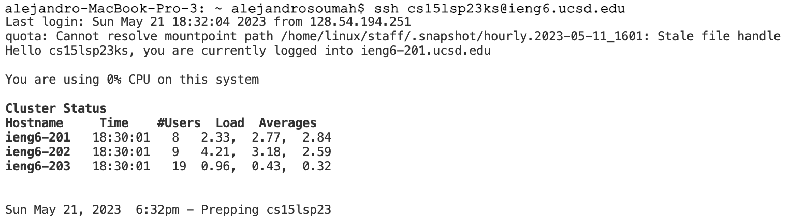
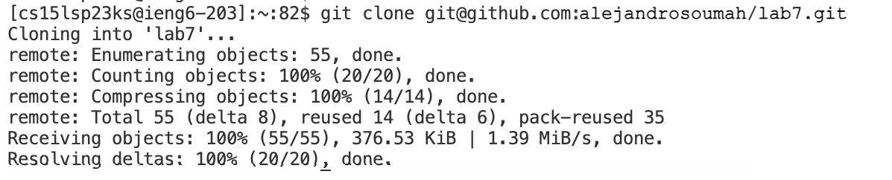
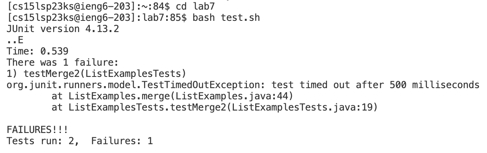
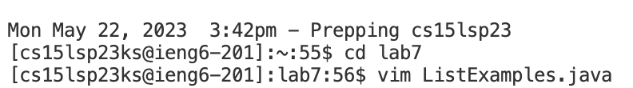
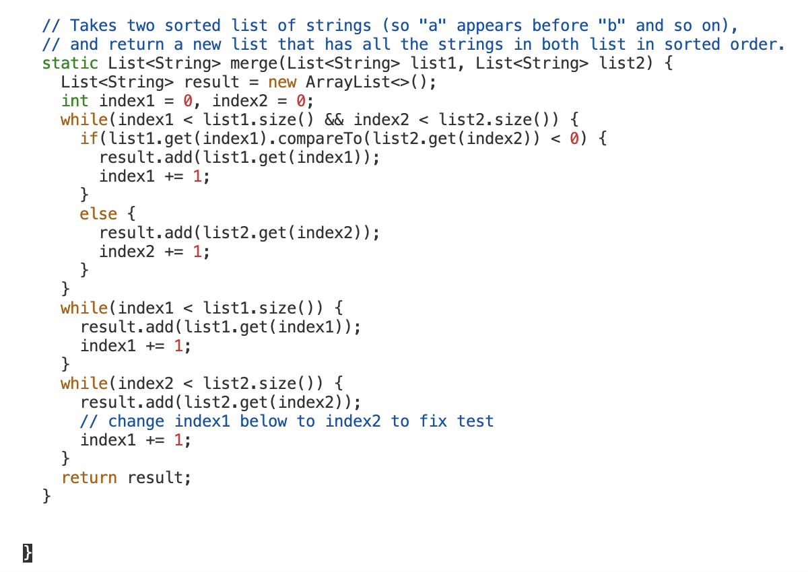
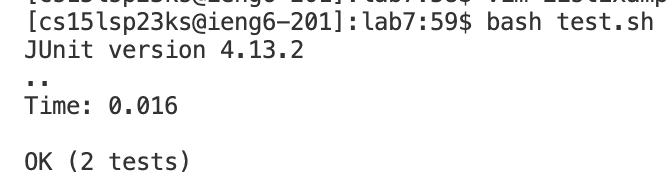

# Lab Report 4

### Step 4

Opened a new terminal and then I  pressed the keys: typing in the login <'cs15lsp23att@ieng6.ucsd.edu'> <'enter'> and then the password <'enter'> that executed the command

### Step 5

I copied the forked github repo link from my github account.
  
Keys pressed: git clone Ctrl+V <'enter'> where Ctrl+V contained: `git@github.com:alejandrosoumah/lab7.git` that pasted the command into the terminal

### Step 6

Typed "cd" to change the directory. I then wrote "lab7" and then clicked <'enter'> this made it change the directory to "/lab7"
  
In order to see the tests contained in "ListExamples.java", I typed "bash test.sh" and then pressed <'enter'>
  
### Step 7  <'enter'>

Typed "cd lab7" to change the working directory to lab7

To edit the file "ListExamples.java" into errors so I typed "vim ListExamples.java" and then pressed <'enter'> to access the vim editor and fix the code.

Keys pressed: <'down'> 14 times then <'right'> 21 times then <'backspace'> 2 times to delete the '<,0>'
To fix the second error, I pressed <'down'> 28 more times and <'left'> 6 times to replace the "1" with "2" for "index1"

Next, I pressed Ctrl + X to exit the vim editor and <Y> to confirm to save changes. Then I pressed <'enter'> to return to the terminal.

### Step 8

I returned to the terminal and I ran the command bash test.sh to demonstrate that the error has been fixed and the tests now succeed.

### Step 9

  
I ran the command git add ListExamples.java to stage the file in order to commit it to GitHub. To confirm that my changes have been appropriately saved, I ran the command git status. I then ran the command git push https://github.com/emilynpark/lab7 to push the changes to my GitHub account. Afterwards, I ran the command git commit -m "Updated file" to
